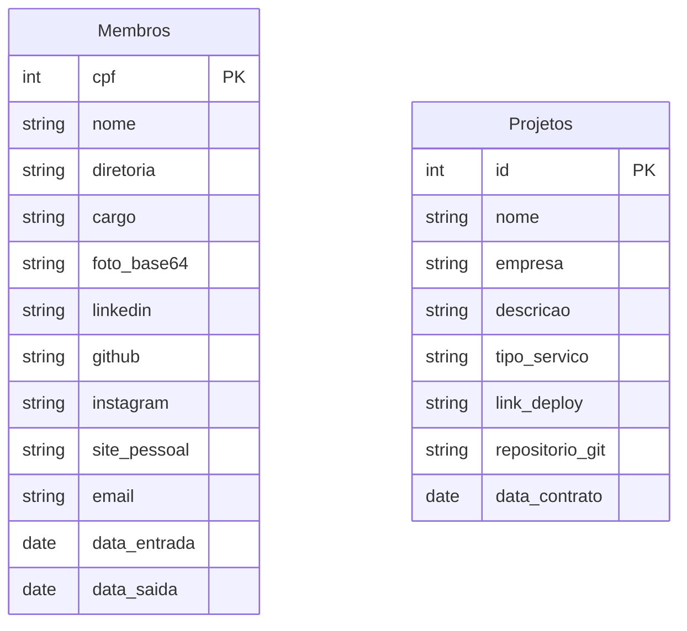

# Inove Jr - Site Institucional

[](https://git-scm.com/)
[](https://nodejs.org/)
[](https://nextjs.org/)
[](https://react.dev/)
[](https://tailwindcss.com/)
[](https://ui.shadcn.com/)


[](https://developers.google.com/apps-script?hl=pt-br)
[](https://developers.google.com/sheets?hl=pt-br)

## :bookmark_tabs: Manual

[Git Cheatsheet](https://github.com/d3vlopes/git-ultimate-cheatsheet) - Comandos Git

[Commits semânticos](https://github.com/AdrianaSaty/colinha-commit-semantico) - Padrões de Commits

[Configurar SSH](https://www.freecodecamp.org/portuguese/news/como-obter-e-configurar-suas-chaves-ssh-do-git-e-do-github/) - Conectar com Github via SSH

## :link: Links

- [Identidade Visual](https://drive.google.com/file/d/1yOQcqmh1tpRxPFTZ8AC989uqr5o6NlEZ/view?usp=sharing)

- [Logo](https://drive.google.com/drive/folders/1hycFttjppTd9jJmM9ChGrYdXCd-CasqE?usp=sharing)

- [Fonte](https://drive.google.com/drive/folders/1ncFGqkyWxCgErlYHHWXWFFbvX1WBxrDI?usp=sharing)

- [Figma](https://www.figma.com/file/EDiZutXRORcMXrVqgm40Vv/i9-Website)

- [Ícones](https://lucide.dev/)

## :hammer_and_wrench: Pré Requisitos

- [ ] [Git](https://git-scm.com/downloads)
- [ ] [Node.js](https://nodejs.org/en/download)

## :technologist: Guia de Desenvolvimento

### :sparkles: Iniciar Projeto

#### Clonar Repositório

```bash
git clone git@github.com:inove-jr/i9-website.git
```

#### Instalar Dependências

```bash
npm install
```

#### Executar em desenvolvimento

```bash
npm run dev
```

### :twisted_rightwards_arrows: Fluxo de Desenvolvimento

#### Assinar uma Issue


#### Criar Branch

1. Cria uma Branch para a Issue


2. Escolhe a Branch "develop" para ser a ramificação de origem


3. Cria a Branch


4. Cole o Comando no Terminal para começar a Tarefa


#### Realizar a tarefa

- Realize os commits necessários na branch da tarefa

```bash
git commit
```

- Envie as modificações para o GitHub

```bash
git push
```

#### Criar um Pull Request

1. Selecione a branch da tarefa


2. Abra um Pull Request


3. Coloque a branch "develop" como destino


4. Finalize o Pull Request

## :globe_with_meridians: Arquitetura


### :oil_drum: Google Sheets


